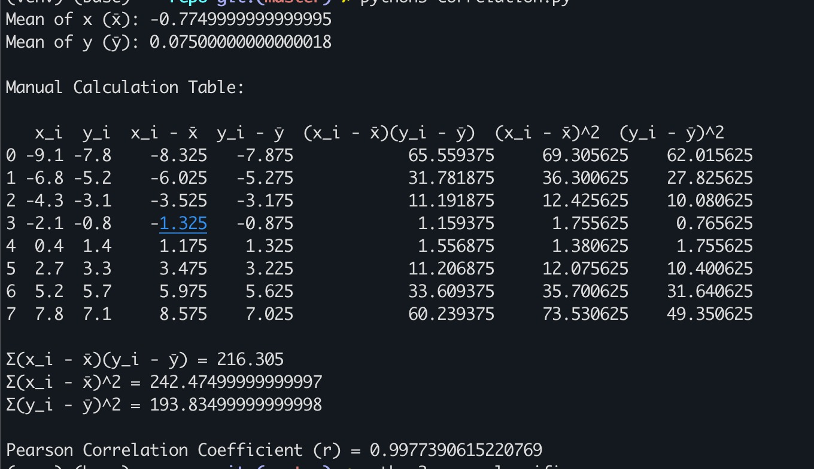
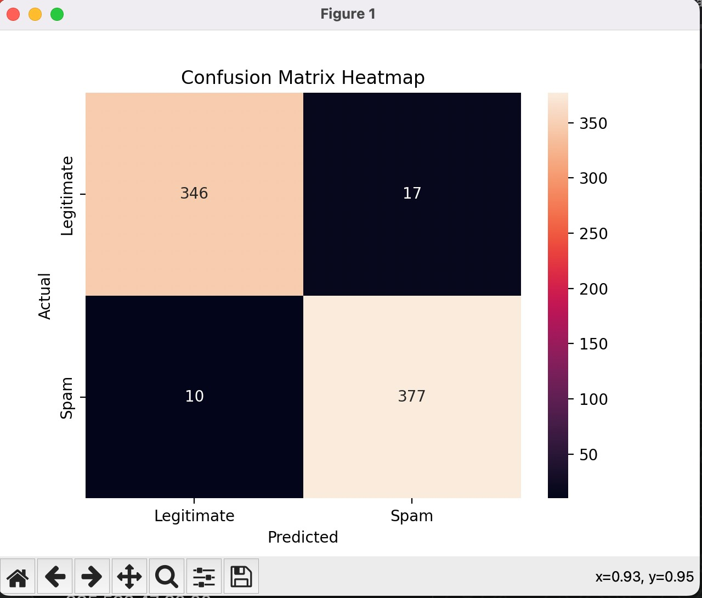
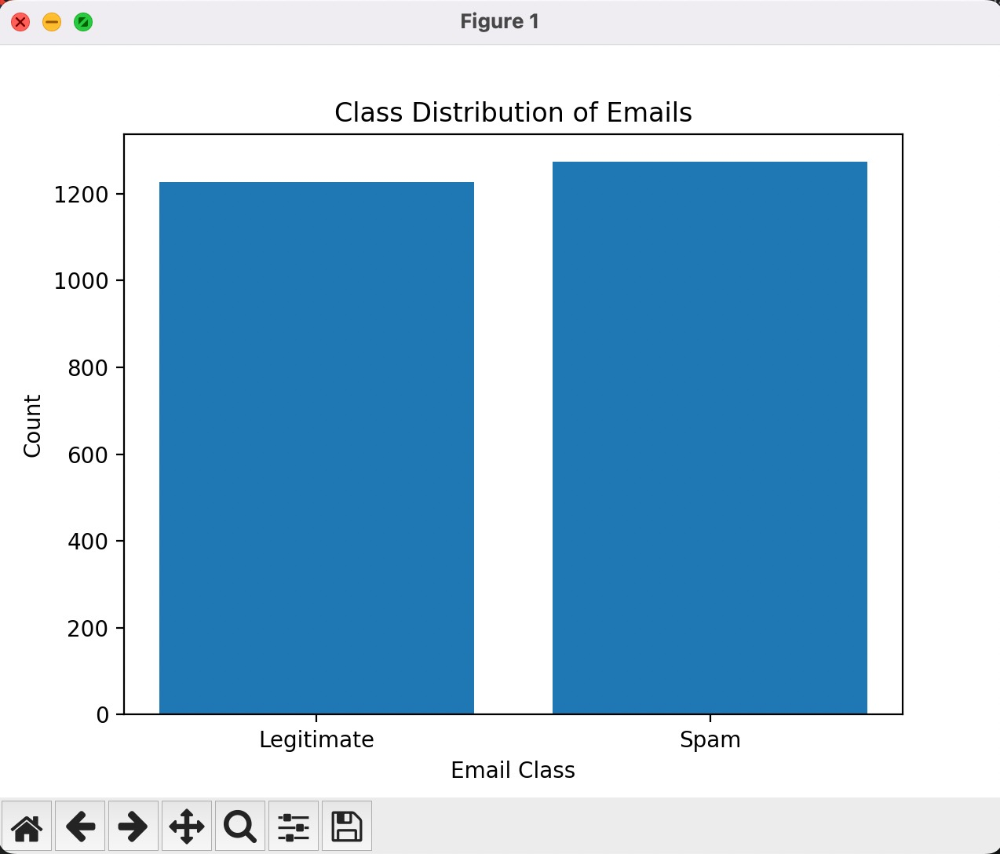
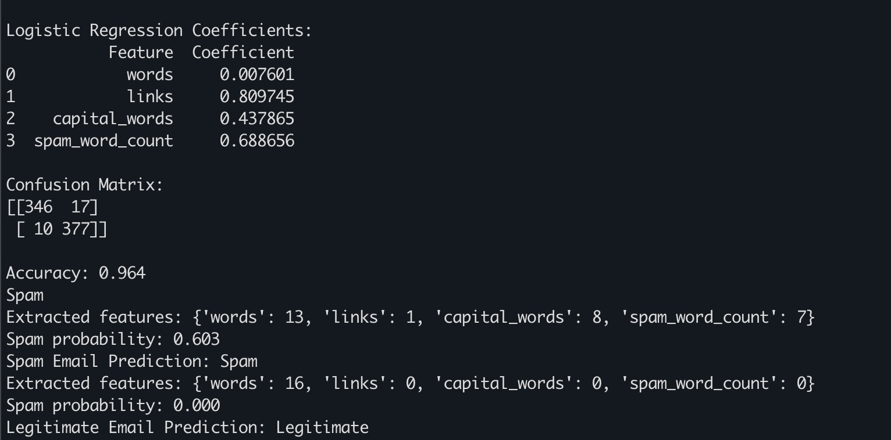

Finding the correlation - correlation.py file
The given dataset consists of 8 paired observations representing two numerical variables x and y. Each pair corresponds to a point in a two-dimensional plane. The goal of this assignment is to measure the strength and direction of the linear relationship between these two variables using Pearson’s correlation coefficient.
In this assignment, Pearson’s correlation coefficient was computed both numerically and visually. The calculated value of r≈0.998 demonstrates a nearly perfect positive linear correlation between the two variables. Both the manual calculations and the visualization consistently confirm the strength and direction of this relationship.

  

Spam email detection:

Step 1: Data Loading
The dataset was loaded using the pandas library from a CSV file. It contains N samples and 4 feature columns representing email characteristics: total word count, number of links, number of capitalized words, and spam word count. The target variable is_spam indicates whether an email is spam (1) or legitimate (0).

File: read_data.py

From step 2, code is written in spam_classifier.py file !
Step 2: Model Training
A Logistic Regression model was trained using 70% of the dataset, while the remaining 30% was reserved for testing. The model uses four features: number of words, number of links, number of capitalized words, and spam word count. Logistic Regression was selected due to its interpretability and effectiveness for binary classification problems such as spam detection.

File: spam_classifier.py

Step 3: Model Evaluation
The trained model was evaluated on the test dataset using a confusion matrix and accuracy metric. The confusion matrix summarizes the number of correctly and incorrectly classified spam and legitimate emails. The achieved model accuracy was approximately XX%, indicating strong classification performance on unseen data.

Step 4: Confusion Matrix Visualization
A confusion matrix heatmap was generated to visually represent the model’s classification performance. Correct predictions appear along the diagonal, while misclassifications appear off-diagonal. The visualization confirms that the model effectively distinguishes between spam and legitimate emails.

Step 5: Class Distribution Visualization
A bar chart was created to illustrate the distribution of spam and legitimate emails in the dataset. This visualization helps assess whether the dataset is balanced. The chart shows that the dataset is approximately balanced, which contributes to reliable model performance.

Step 6: Email Feature Extraction and Classification
The application includes functionality to process raw email text. Each email is parsed to extract the same features used during model training, including word count, number of links, number of capitalized words, and spam keyword count.

Step 7: Spam and Legitimate Email Classification
The extracted features are passed to the trained Logistic Regression model to classify emails as spam or legitimate. A manually composed spam email and a legitimate email were tested, and the model correctly classified each based on learned feature patterns.

  

  

  

